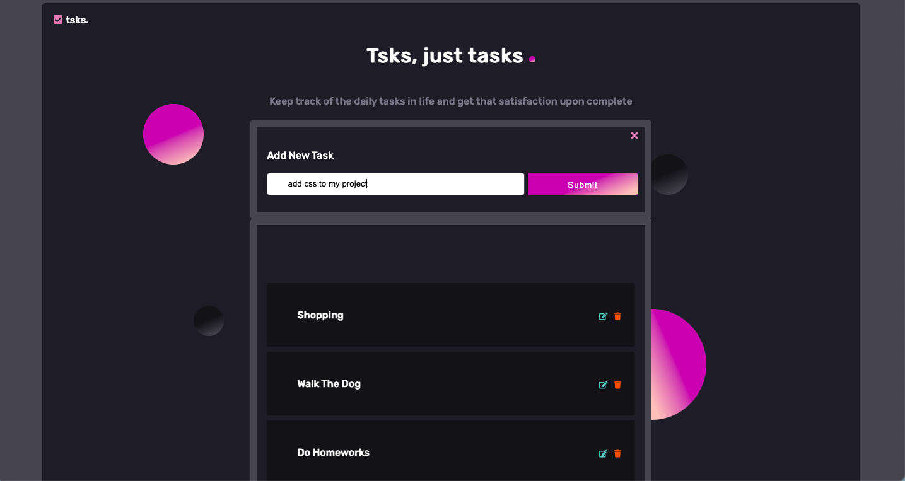

## Tsks.

this task manager is a fullstack project ,connected to mongoDB atlas.

Style inspired by [dribbble](https://dribbble.com/shots/15111239-Landing-page-WIP/attachments/6844861?mode=media)

## features

- [x] Show all tasks from database.
- [x] Add new task to database.
- [x] Update a task.
- [x] Delete a task.

## Project setup

In order to run the project, setup **.env** and set _MONGO_URI_variable equal to_DB_ connection string.

In order to avoid port collisions, In the source code port value is 3000.
